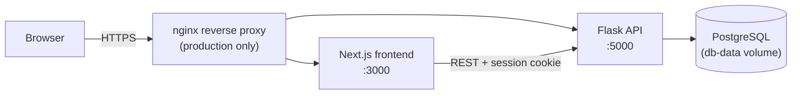

# PlannerPro

A university timetable planner that computes every possible combination of lectures,
lab sessions, and tutorial groups, and ranks them by schedule quality — instead of you
manually checking dozens of tutorial-group combinations for time conflicts.


## The problem

Most university modules have a fixed lecture time, but several parallel tutorial or lab
groups to choose from. With 5 modules and 3 tutorial group options each, that's already
3⁵ = 243 possible timetables to check by hand for overlaps — and picking the one with
the fewest gaps between classes is close to impossible to do manually.

PlannerPro takes the modules you enter (lectures, labs, and any number of optional
tutorial groups per module), generates **every** valid combination, scores each one, and
shows you the best options — ranked, with conflicts and gaps highlighted.

## Features

- **Exhaustive optimization** — every combination of tutorial/lab groups is generated and
  scored; nothing is skipped or approximated.
- **Conflict + gap scoring** — the ranking heavily penalizes overlapping classes and
  lightly penalizes idle gaps between classes on the same day, so the top result is
  both conflict-free (if possible) and reasonably compact.
- **Multi-project support** — keep separate plans per semester, saved per account.
- **Session-based auth with email verification** — register with a username, email, and
  password; confirm the email via a short-lived code. Login is by email + password.
  Username, password, and email can all be changed later in Settings (an email change
  re-verifies the new address and leaves the old one active until confirmed); a
  code-based password reset is available for locked-out users.
- **Offline-friendly editing** — drafts are cached in `localStorage` and reconciled
  against the server's last-saved timestamp, so an unsaved edit in one tab doesn't get
  silently overwritten by a newer save from another device.

## How the optimizer works

For each module, the backend builds the list of viable slot combinations: the mandatory
lecture/lab slots plus, if the module has tutorial groups, one combination per group
(groups are mutually exclusive — you attend one). The full timetable space is the
Cartesian product of every module's options:

```python
all_combinations = itertools.product(*module_options)
```

Each resulting timetable is scored: a large penalty per minute of overlapping classes,
a smaller penalty per minute of idle gap between classes on the same day, and a small
bonus for compact days. The top 15 by score are returned.

This is deliberately a brute-force search, not a heuristic — for the problem size a
student's actual timetable involves (a handful of modules, a handful of tutorial
groups each), computing every option is fast and guarantees the true optimum, which a
greedy or heuristic approach wouldn't. The trade-off is that the combination count
grows exponentially with the number of optional tutorial groups, so the API rejects
requests above a fixed combination cap (`MAX_COMBINATIONS` in `app.py`) instead of
hanging — see [Roadmap](#roadmap) for how this would need to change to scale further.

## Architecture



Locally (and in the current single-server deployment), the frontend and backend run as
two containers via `docker-compose.yml`, each reachable directly on its own port. The
nginx layer is a production-only addition that terminates TLS and routes a single public
domain to both containers — it's not part of the local dev setup.

## Tech stack

| Layer    | Choice                                                             |
| -------- | ------------------------------------------------------------------- |
| Frontend | Next.js (App Router), React, TypeScript, Tailwind CSS               |
| Backend  | Flask, Flask-SQLAlchemy, Flask-Login, Flask-Migrate, Flask-Limiter   |
| Database | PostgreSQL (via `docker-compose.yml`'s `db` service; SQLite also works via `DATABASE_URL`) |
| Auth     | Session cookies, bcrypt password hashing (SHA-256 pre-hashed), email verification codes |
| Testing  | pytest (backend), Jest + React Testing Library (frontend)           |
| Infra    | Docker, docker-compose                                              |

## Getting started

Requires Docker and Docker Compose.

```bash
git clone <this-repo>
cd planer_pro
cp .env.example .env   # then fill in FLASK_SECRET_KEY (see comments in the file)
docker compose up --build
```

- Frontend: http://localhost:3000
- Backend API: http://localhost:5000

The Postgres database lives in the `db-data` named Docker volume, so data survives
`docker compose down` / restarts (only `docker compose down -v` or `docker volume rm`
removes it). Schema changes are applied automatically on container start via
`flask db upgrade` (see `backend/entrypoint.sh`); `backend` waits for `db`'s healthcheck
before starting. Prefer SQLite instead (e.g. for running the backend outside Docker)?
Set `DATABASE_URL=sqlite:///project.db` — it's stored in the `instance-data` volume the
same way.

### Demo account

A demo account is available for trying out the app without registering. Login is by
email, not username:

| Email                  | Password   | Username |
| ---------------------- | ---------- | -------- |
| `demo@planerpro.local` | `demo1234` | `demo`   |

It starts with no projects — add one from the UI to see the optimizer in action. (It's
a regular account with no special privileges, just pre-created; feel free to register
your own instead.) On a fresh database (e.g. a new `db-data` volume), create it with:

```bash
docker compose exec backend python -m scripts.seed_demo
```

### Email delivery

Registration, email changes, and password reset all send a 6-digit verification code
by email. Without SMTP configured, no email is actually sent — the code is written to
the backend logs instead (`docker compose logs -f backend`, look for `SMTP not
configured`), so the full flow still works end-to-end for local development with zero
setup. To send real emails, set `SMTP_HOST`/`SMTP_PORT`/`SMTP_USERNAME`/`SMTP_PASSWORD`
in `.env` (any standard SMTP provider works — see [`.env.example`](.env.example)).

### Environment variables

See [`.env.example`](.env.example) for the full list with explanations. The important
one: **`FLASK_SECRET_KEY` is required** unless `DEBUG=true` — the app refuses to start
without it rather than falling back to an insecure default.

## Running tests

```bash
# Backend
cd backend
python -m venv venv && source venv/bin/activate
pip install -r requirements-dev.txt
pytest

# Frontend
cd frontend
npm install
npm test
```

## Project structure

```
backend/
  app.py              # App factory, routes, the optimizer algorithm
  database.py          # SQLAlchemy models
  migrations/          # Alembic schema migrations
  scripts/              # One-off maintenance scripts (e.g. seed_demo.py)
  tests/                # pytest suite
frontend/
  src/app/              # Next.js pages (App Router)
  src/app/components/   # UI components (TimeSlotList, ResultsView, Navbar)
  src/context/          # Auth + Toast providers
  src/lib/              # Pure helpers (axios client, scheduling math)
  src/types/            # Shared TypeScript types
```

## API overview

All endpoints are prefixed `/api` and use session-cookie auth (`@login_required` unless
noted).

| Method & path                     | Description                                        |
| ---------------------------------- | ---------------------------------------------------- |
| `POST /register`                   | Create an account (username, email, password)       |
| `POST /login` / `POST /logout`     | Session login/logout (login is by email)             |
| `GET /me`                          | Current user (no auth required)                      |
| `POST /verify-email`               | Confirm the registration email with its code         |
| `POST /resend-verification-email`  | Send a new registration verification code            |
| `POST /settings/username`          | Change the current user's username                   |
| `POST /settings/password`          | Change the current user's password                   |
| `POST /settings/email`             | Request an email change (sends a code to the new address) |
| `POST /settings/email/verify`      | Confirm a pending email change with its code          |
| `POST /settings/email/cancel`      | Cancel a pending email change                         |
| `POST /password-reset/request`     | Send a password-reset code (no auth required)         |
| `POST /password-reset/confirm`     | Reset the password with that code (no auth required)  |
| `GET/POST /projects`               | List / create projects                                |
| `GET/PUT/DELETE /projects/:id`     | Read, save modules, or delete a project               |
| `POST /optimize`                   | Run the optimizer over a set of modules               |
| `DELETE /delete-account`           | Delete the current account and all its data           |

## Roadmap

Things I'm deliberately deferring rather than treating as finished:

- [ ] GitHub Actions workflow to auto-deploy `main` to the production server
- [ ] Production nginx config + TLS (Let's Encrypt) in front of the containers
- [ ] OpenAPI/Swagger documentation for the API
- [ ] Redis-backed rate limiter storage, so the backend can run more than one
      gunicorn worker/instance (the current in-memory limiter assumes a single
      process — see `CLAUDE.md`)
- [ ] Smarter-than-brute-force optimization (branch-and-bound / pruning) if the
      combination cap turns out to be too limiting in practice

## License

MIT — see [LICENSE](LICENSE).
